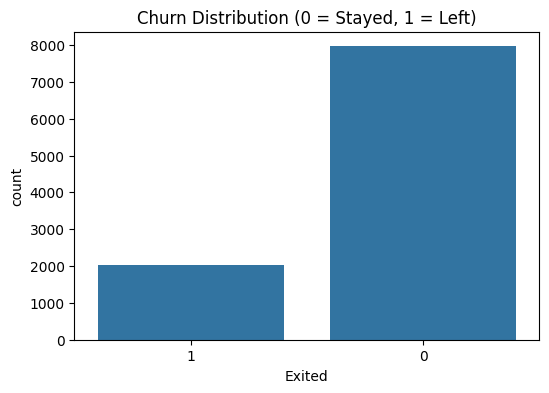
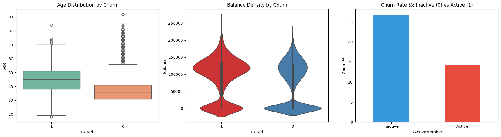
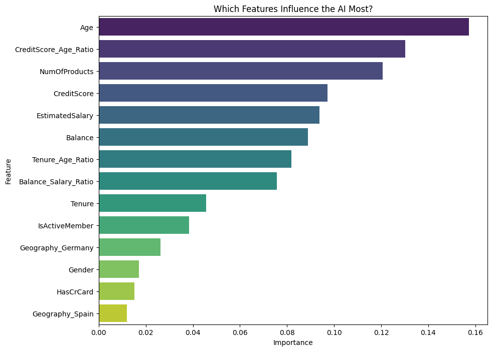

# Bank Customer Churn Analysis & Prediction 🏦

## Project Overview
This project presents an end-to-end machine learning solution designed to identify high-risk customers for a multinational banking institution. By leveraging historical data, the researcher performed comprehensive Exploratory Data Analysis (EDA) and built a predictive model to assist the bank in reducing capital flight and improving customer retention strategies.

## Repository Structure
The project is organized into a modular structure to ensure reproducibility and professional standards:

* **`data/`**: Contains the `Churn_Modelling.csv` dataset, representing 10,000 unique banking customers.
* **`notebooks/`**: Houses the primary Jupyter Notebook, documenting the full pipeline from SQL extraction to model evaluation.
* **`output/`**: Stores visual assets, including feature importance rankings and churn distribution charts, for quick stakeholder review.
* **`requirements.txt`**: Lists all Python dependencies required to replicate the environment.

## Data & Feature Engineering
Beyond basic data cleaning, the researcher implemented advanced feature engineering to uncover hidden behavioral patterns:

* **`CreditScore_Age_Ratio`**: Created to measure financial health relative to the customer's life stage.
* **`Balance_Salary_Ratio`**: Developed to identify customers with high capital intensity compared to income.
* **`Tenure_Age_Ratio`**: Calculated to normalize loyalty metrics across different age demographics.

## Exploratory Data Analysis (EDA) Insights
The analysis revealed several critical drivers of customer attrition, visualized through distribution and density patterns.

### 1. Class Distribution
The dataset exhibits a significant class imbalance, with approximately **8,000** customers staying and **2,000** customers exiting. This prompted the use of specialized metrics like Precision and Recall rather than Accuracy alone.



### 2. Behavioral Patterns
The researcher identified three primary pillars of churn behavior:

* **Age Risk (Boxplot)**: A clear "churn peak" exists in the 40-50 age bracket. Customers who stay are generally younger, with a median age in the mid-30s.
* **Capital Density (Violin Plot)**: Customers who leave (`Exited=1`) show a high concentration of account balances around the **$125k** mark, whereas staying customers have a more varied distribution including many near-zero balances.
* **Activity Gap (Bar Chart)**: Inactive members churn at a rate of **~27%**, nearly double the **~14%** churn rate observed in active members.



## Machine Learning Results
A **Random Forest Classifier** was trained and optimized. The researcher utilized `class_weight='balanced'` to ensure the model effectively learned the characteristics of the minority churn class.

### Model Performance
* **Accuracy**: The final model achieved a score of **86%**.
* **Precision**: A precision of **79%** for churners ensures that retention efforts are targeted accurately to minimize marketing waste.
* **Recall**: The model successfully identifies a significant portion of potential churners (**42%-46%**) while maintaining high confidence in its predictions.

### Feature Importance
Analysis confirmed that **Age** and the engineered **`CreditScore_Age_Ratio`** were the top two drivers influencing the model's decisions, validating the researcher's feature engineering strategy.



## How to Run the Project
To reproduce this analysis locally, follow these steps:

1.  **Clone the Repository**:
    ```bash
    git clone [https://github.com/your-username/bank-churn-prediction.git](https://github.com/your-username/bank-churn-prediction.git)
    ```
2.  **Setup Environment**:
    Ensure Python 3.12+ is installed. It is recommended to use a virtual environment.
3.  **Install Dependencies**:
    ```bash
    pip install -r requirements.txt
    ```
4.  **Database Connection (Optional)**:
    If utilizing the SQL extraction portion, ensure your MySQL instance is active and update the connection string in the notebook.
5.  **Execute Analysis**:
    Open the `.ipynb` file in VS Code or Jupyter Lab and execute the cells sequentially to see the data processing, EDA, and model training.